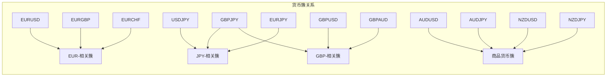

# 执行摘要

我构建了一套改进后的机构级外汇CTA趋势跟踪组合策略，目标在可控风险下持续捕捉中长期趋势收益。策略以**时间序列动量**和**横截面动量**为信号主轴，辅以**趋势质量因子**对噪声行情加以过滤，并综合采用**波动率目标控制**、**货币因子风险控制**、**相关性与风险簇管理**等多层次风控。我们建议交易日线级别的历史数据（至少过去20年），以每日美东收盘统一计算并调整仓位。主要改进包括：参数优化（如趋势评分阈值、波动率窗口）、信号体系增强（如加入不同动量期、动态阈值）、更细化的风险预算（单笔风险0.5%、单品种波动贡献上限≈8%）、引入**风险簇**管理与**货币因子暴露**约束、防范过度集中。我们还设计了**伪代码与流程图**描述每日执行流程，并制订了**回测与实盘检验方案**，包括滚动回测窗口、参数寻优方法、绩效与风险指标（年化波动、最大回撤、夏普、Sortino、回撤持续期等）以及压力测试场景（极端汇率、流动性枯竭、利率冲击等）。监控方面，将跟踪组合波动率、各维风险贡献与因子暴露，设置警报阈值。以下报告详述策略定位、指标定义、参数建议、执行流程、伪代码示例、各类表格与图表，以及潜在改进优先级与时间表等内容。

## 策略定位

本策略定位为**机构级外汇CTA趋势跟踪策略**。其核心假设是：外汇市场存在持续性的趋势机会，通过系统化信号捕捉，长期内可获得稳健收益；同时，通过多层风控管理，控制风险敞口、分散各类风险源，保证组合安全。策略特点包括：

- **不做顶部/底部预测**：主要依据趋势延续性信号，避免人为抄底抄顶。  
- **多因子趋势信号**：结合不同周期的动量指标与趋势质量因子，全方位评估趋势强度与稳定性（类似AQR研究显示，多周期动量综合可在牛熊市中获得高Sharpe【22†L1126-L1134】）。  
- **严格风险管理**：综合波动率目标、风险贡献约束、货币因子暴露、风险簇约束和账户回撤控制，防止单一风险爆发（Greyserman等研究强调CTA成功关键在风险管理【10†L78-L85】）。  
- **规则透明严谨**：全程系统化决策，避免主观干预。信号逻辑、风险规则、止损加仓规则等均有明确数学定义与阈值。  

策略主要参考了时序动量与交叉动量的经典文献【22†L1126-L1134】【27†L21-L29】及行业实践经验，目标对机构量化团队提供可执行且可监控的设计。


## 交易范围

策略交易主要在流动性高、点差稳定、易执行的主要外汇货币对上。考虑历史数据质量及市场深度，典型品种包括：

- **美元系**：EUR/USD、GBP/USD、USD/JPY、USD/CHF、USD/CAD、AUD/USD、NZD/USD  
- **日元系**：EUR/JPY、GBP/JPY、AUD/JPY、CAD/JPY、CHF/JPY、NZD/JPY  
- **其他交叉**：EUR/GBP、EUR/AUD、EUR/CHF、GBP/AUD、GBP/CAD、GBP/CHF、AUD/NZD、AUD/CAD、NZD/CAD  

仅纳入符合以下条件的货币对：  
- **流动性充足**：日均交易量大、易于进出（例如主要货币对）【27†L21-L29】。  
- **点差可接受**：点差稳定且小，避免超宽点差（一般主流ECN下EUR/USD≈0.2-0.5pip，其他主流低于1pip）。  
- **隔夜成本合理**：隔夜利息成本透明可控，不出现高昂成本的货币对。  
- **历史数据良好**：历史行情数据完整，不存在质量缺失或剧烈缺口。  
- **无流动性限制**：无臨時监管、市场关闭或重大流动性崩溃事件影响。  

对不满足条件的品种，策略会自动剔除。例如，在极端市场中如点差扩大超过阈值，则暂停该品种交易，直到恢复正常。


## 数据与执行频率

- **数据频率**：采用**日线数据**（每日收盘价）。每个交易日以纽交所收盘后的价格作为信号计算时点。  
- **历史样本期**：建议至少20年以上历史数据（若可用，如1980年以来主要货币对数据），以覆盖多个市场周期。  
- **执行频率**：**日盘后/日线级别**的信号计算与交易。每天统一进行所有信号、风险计算和组合再平衡。  
- **设计目的**：利用日频降低短期噪声、避免过度交易，与趋势策略的中低频特性匹配；确保信号稳定、易解释。  

实际交易时，根据不同券商要求，可在日线收盘后（UTC+时区）进行批量下单或第二日开盘时执行。若某日出现特殊行情（如重大事件导致的价格跳空），策略设置流动性过滤，由人或算法判断是否继续执行。


## 信号体系与因子定义

### 方向层（Time-Series Momentum 策略）

方向层用于识别趋势的存在与方向，不预测拐点，仅判断趋势是否成立。

- **计算指标**：   
  - $R_{3M}$：过去3个月（大约60个交易日）累积收益率。  
  - $R_{6M}$：过去6个月收益率。  
  - $R_{12M}$：过去12个月收益率（注意可采用60日、120日、240日收盘价数据计算）。  

- **方向得分（Direction Score）**：线性组合  
  $$\text{Direction Score} = 0.4\,R_{3M} + 0.3\,R_{6M} + 0.3\,R_{12M}.$$  

  这个多周期加权方案平衡了近期动量与中长期趋势，有助降低单一12个月动量滞后性（与研究相符，多周期组合可提高预测效果【22†L1126-L1134】）。权重可调（如$w_{3M}=0.4\pm0.1$，$w_{6M}=0.3\pm0.1$, $w_{12M}=0.3\pm0.1$），需确保总和为1。

- **交易规则**：  
  - 设定**方向阈值** $T$（正值）。  
  - 当某货币对 $\text{Direction Score} > +T$ 时，视为存在向上趋势，允许做多；当 $\text{Direction Score} < -T$ 时，视为存在向下趋势，允许做空。  
  - 当 $|\text{Direction Score}| \le T$ 时，认为当前无明显趋势，不交易该标的。  

  阈值 $T$ 可以根据历史方向得分的分布（如均值、标准差）或采用动态分位数（如取上/下5%、10%的分位点作为$T$）来确定。具体数值需历史模拟验证，一般初值可设$T=0$或略大，根据市场环境（波动高时可稍增大，以避免噪音）做微调。

### 横截面动量排序层

在方向层选出的“可交易方向”范围内，进一步择优选择强动量品种。

- **计算指标**：  
  $$\text{Momentum Score} = 0.6\,R_{3M} + 0.4\,R_{6M}.$$  
  即剔除$R_{12M}$，只关注较短期（3M、6M）回报，以避免信号滞后，同时体现短中期趋势强度。

- **说明**：  
  - 此指标用于**横截面比较**：不直接决定做多/做空方向，而是对符合方向条件的品种进行排名。  
  - 按Market Basket内的Momentum Score从高到低排序，择前列（多头池）或末尾（空头池）作为候选。  
  - 比如可以设定候选分位门槛 $Q$（如25%），只保留前$Q$的做多池和后$Q$的做空池。  

### 趋势质量因子

除了趋势强度（动量）以外，还要评估趋势的平滑稳定程度，过滤噪声行情。我们定义**Trend Quality**指标：

- **构造方法**：对最近200日（可调）的收盘价序列做简单线性回归，得到回归斜率 $s$ 和拟合优度 $R^2$。  
  - $s$（Slope$_{200}$）：200日价格序列对时间的回归斜率，反映趋势方向和强度。  
  - $R^2$：回归拟合优度，衡量价格变化的线性程度（接近1表示非常平滑趋势，接近0表示震荡剧烈）。

- **归一化波动**：为消除不同货币对波动率尺度的影响，以预估波动率 $\sigma_{\mathrm{est}}$ 归一化斜率。例如使用$20$日ATR（或EWMA）估算当前波动。

- **趋势质量定义**：  
  $$\text{Trend Quality} = \left(\frac{s}{\sigma_{\mathrm{est}}}\right) \times R^2.$$  
  该指标越高，表示趋势既方向明确、稳定平滑、噪声少，越值得信赖。震荡行情下$R^2$低，即使短期动量高也会降低优先级。  

该因子用于**过滤**动量信号。例如，若动量因子值高但趋势质量低，表明近期虽上涨幅度大但走势可能波动剧烈，此时可降低该信号的最终评分权重。  

### 风险调整后动量

为实现风险管理，我们引入**风险调整动量**指标，对动量信号按波动率作标准化：

$$\text{Risk Adjusted Momentum} = \frac{\text{Momentum Score}}{\text{Forecast Volatility}},$$

其中`Forecast Volatility`为对标的未来波动率的估计（见下一节）。该指标衡量单位风险下的趋势强度，更高值说明同等风险敞口下收益预期更优。在多个品种构建组合时，可根据该指标加权分配，以避免高波动品种无差别地占优（概念与风险平价类似【12†L186-L194】）。

### 因子标准化与综合评分

- **横截面Z-score**：将所有持仓品种的风险调整动量值和趋势质量值分别进行横截面标准化（Z-score），得到 $Z_{\text{Momentum}}$ 和 $Z_{\text{Quality}}$。这样做可消除因子尺度差异，使得不同货币对可直接比较。  

- **最终综合评分**：  
  $$\text{Final Score} = 0.8 \times Z_{\text{Momentum}} + 0.2 \times Z_{\text{Quality}}.$$  
  这里我们给予动量因子更高权重（80%），因为经验和文献显示动量通常是主要驱动收益的因素；趋势质量因子起辅助作用（20%），用于降低噪声信号权重。权重可根据实际性能（通过回测、贝叶斯优化或稳健性测试）调整。  

- **候选池生成**：每日计算所有品种的Final Score后，按方向分组生成候选池：  
  - **多头候选池**：满足 $\text{Direction Score}>+T$ 且 $\text{Final Score}$ 排名处于全市场前 $Q\%$ 的品种。  
  - **空头候选池**：满足 $\text{Direction Score}<-T$ 且 $\text{Final Score}$ 排名处于后 $Q\%$（最低） 的品种。  

  例如可设 $Q=25\%$，即选取动量和质量都较高的前1/4品种开多或开空。其他品种当天不入池，不开新仓，从而集中火力于强趋势品种。

通过上述多层筛选，可确保开仓的仓位：  
1. 方向上已有趋势支持（多头或空头），  
2. 相对而言动量较强、质量较好。  

这一信号体系借鉴了多因子风险平衡的思想【12†L186-L194】【22†L1126-L1134】。


## 因子参数与建议设置

下表列出主要信号与风险控制因子参数的默认值及可调范围建议：

| 因子/参数                    | 默认值            | 可调范围        | 说明                                                         |
|-----------------------------|------------------|-----------------|------------------------------------------------------------|
| 3M/6M/12M 周期收益权重      | 0.4 / 0.3 / 0.3 | 各权重±0.1，和为1  | 方向评分和动量评分中用到的各周期回报权重，应和为1。                |
| 方向阈值 $T$                | 0（可调）        | ±(0~市场波动)    | 判定趋势存在的阈值。可初设0，也可根据历史分布（如正态1σ）/分位设置（如上5%）。    |
| 候选池分位门槛 $Q$          | 25%              | 10%~50%         | 多空候选池选取比例，较低值集中更强品种，较高值分散更广。         |
| 波动率估计 (EWMA λ)         | 0.97             | 0.95~0.99       | EWMA波动率平滑参数，越接近1记忆越长。推荐0.97用于动态调整仓位。   |
| 相关性估计 (EWMA λ_corr)    | 0.99             | 0.95~0.995      | EWMA相关矩阵参数，建议高于波动率参数以跟踪大类资产关联。         |
| ATR 窗口长度                | 20日             | 10~60日         | ATR计算窗口。20日为常见值，可根据持仓期限调整。                  |
| ATR 初始止损倍数             | 2.5              | 2.0~3.5         | 初始止损距离 = ATR × 倍数。经验值2.5倍【28†L39-L43】，可微调。      |
| Chandelier 追踪止损倍数      | 3.0              | 2.5~4.0         | Chandelier止损因子，OANDA建议2.5~4【28†L39-L43】。控制尾部风险。   |
| 单笔风险（账户%）           | 0.5%            | 0.25%~1.0%      | 每笔交易最大允许亏损额占总权益比例。0.5%为常见值，可根据风险偏好调整。 |
| 组合目标年化波动率          | 10%              | 9%~11%         | 组合年化波动率目标，使用动态杠杆调整。设区间9%~11%避免频繁跳动。   |
| 单品种风险贡献软/硬上限    | 8% / 10%        | 5%~12%         | 单品种对组合总风险的贡献不超过8%（软上限），极限不超10%（硬上限）。 |
| 单货币因子暴露上限          | 30% (净敞口)     | 20%~40%         | 单一货币因子的净风险暴露（Risk Contribution）不超过30%，防止过度押注某货币。 |
| 账户回撤阈值 （风险调整）    | 10% / 15% / 20% / 25% | 可按策略规模调整 | 回撤阈值用于分阶段风控：超过10%减半风险，15%降至25%，20%停止新开，25%全平。 |

这些参数需通过历史回测和超额稳健性测试确定。可采用网格搜索、贝叶斯优化等方法，并进行**Walk-forward**回测验证，确保方案不产生过度拟合（有关反复实验和超额拟合的讨论请见【22†L1126-L1134】）。对于尚无历史数据或无法量化的参数（如流动性阈值），可先设合理估计值并在实盘中持续监控、动态调整。

## 波动率与相关性估计

- **波动率估计**：采用**指数加权移动平均（EWMA）**计算预期波动率$\sigma_{\mathrm{est}}$。设日度收益$R_t$，标准方法如下：  
  $$V_t = \lambda V_{t-1} + (1-\lambda)R_{t}^2,$$ 
  $$\sigma_{\mathrm{est}} = \sqrt{V_t}.$$ 
  推荐参数$\lambda=0.97$（相当于约33个交易日的有效记忆），较传统历史标准差更能快速反映波动变化【12†L205-L214】。估计结果用于风险调整和仓位配置。也可考虑GARCH模型或更先进的波动率预测方法，但复杂度和过拟合风险需评估。

- **相关性估计**：使用**EWMA相关矩阵**，参数$\lambda_{\text{corr}}=0.99$或更高，以捕捉相对平稳的货币对间关系。具体步骤：先用EWMA计算各品种方差（波动），再用同一$\lambda$对协方差项做平滑，最后标准化得到相关系数矩阵。动态相关性帮助识别资产关联度：高相关区域视为**风险簇**（见下节），在构建组合时避免簇内过度集中。【12†L195-L203】中提到，引入相关性分配可在过去表现优于简单等风险分配。

- **风险簇识别**：我们定期（如每周）基于当前相关矩阵对货币对进行**层次聚类**，识别主要风险簇。例如，“商品货币簇”（AUD、NZD相关对），“日元簇”（JPY相关对），“欧系簇” 等。每个簇单独设风险预算上限。这样做是基于资产分群分布原理（参见文献【32†L146-L154】），可防止表面上持仓多样化但实质上集中于同一宏观主题下。  

- **多因子风险分解**：每日计算组合各持仓对总风险的边际贡献（Marginal Risk Contribution, MRC）和实际风险贡献（Actual Risk Contribution, ARC）。常见计算为：  
  $$ \text{MRC}_i = w_i (\Sigma w)_i / \sigma_P, \quad \text{ARC}_i = w_i \sum_j \Sigma_{ij} w_j / \sigma_P, $$
  其中$w$为风险平价权重组合，$\Sigma$为协方差矩阵，$\sigma_P$为组合波动。保持$\sum \text{ARC}_i=1$。风险贡献约束将用于加仓与减仓决策：若某单一品种的ARC超过设定阈值（如8%）则触发限制【12†L231-L238】。


## 止损、移动止损与加仓规则

- **初始止损**：每笔交易按ATR进行止损。定义20日ATR作为波动尺度，初始止损距入场价为 $k_1 \times \mathrm{ATR}_{20}$，默认$k_1=2.5$（可调2.0–3.5）。这样不同波动品种的止损距离自动校正，不用硬编码点数。例如当ATR=0.005（半个基点）时，2.5倍止损即1.25个基点。经验表明此级别即可保护交易不被正常波动止盈【28†L39-L43】【29†L29-L36】。

- **加仓策略**：只允许**盈利方向加仓**，不摊平止损交易。常用规则：当持仓浮盈扩大至$k_2\times\mathrm{ATR}_{20}$（默认$k_2=1.0$），可加仓一定比例（例如当前仓位的0.5~1.0倍），最多加仓3次（即原始+3）。每次加仓后立即重新检查风险约束（组合波动、单品种风险、簇风险、货币因子暴露等），如有超限则停止加仓。加仓可提高胜率交易的利用率，同时在尾部情形下增大亏损，需要纪律性约束。

- **移动止损（Chandelier Exit）**：采用Chandelier Exit【28†L39-L43】，进一步锁定利润。规则如下：  
  - 多头：设置止损位为自开仓以来的**最高价**减去 $k_3\times\mathrm{ATR}_{20}$，默认$k_3=3.0$。  
  - 空头：止损位为自开仓以来的**最低价**加上 $k_3\times\mathrm{ATR}_{20}$。  
  由于ATR随波动变化，止损会动态上移（多头）或下移（空头），永远仅沿有利方向调整，不扩大亏损区间。参考文献建议Chandelier多用于趋势延续停利，在趋势衰竭时出场【28†L39-L43】。

- **止盈策略**：主要让利润奔跑，通过移动止损而非固定止盈点。也可设置阶段性目标（如2×ATR浮盈时追加仓位时锁定部分盈利）。在达到强趋势顶点反转前不主动平仓。

总结：每次开仓时同时设初始止损，并持续更新Chandelier止损。当止损被触发或其他退出条件满足时平仓。


## 仓位与杠杆管理

- **单笔风险控制**：每笔开仓的风险敞口按固定比例控制，默认0.5%账户净值（可调$0.25\%\sim1\%$）。具体通过反算头寸规模：  
  $$\text{Position Size} = \frac{(\text{账户权益}\times0.5\%)}{\text{止损点数}},$$  
  其中“止损点数”即初始止损距离（以价格点计）。此方法确保不同波动性的品种承担相近的本金风险，【10†L110-L118】【12†L186-L194】相当于经典的风险平价思想。  

- **组合波动率目标**：设定组合**目标年化波动率**$V_{\text{target}}$，例如10%。每日根据持仓协方差矩阵估算组合预期波动$\hat V_P$，并动态调整整体杠杆：  
  - 若$\hat V_P > V_{\text{target}}$上限，则**去杠杆**：整体资金投入比例降低（卖出部分头寸或减少保证金使用）。  
  - 若$\hat V_P < V_{\text{target}}$下限，则可**适度加杠杆**（在风险预算允许下）。  
  推荐采用宽幅目标区间（如9%~11%），防止频繁调整带来的交易成本和震荡。

  波动率目标常用于Trend Following策略中【19†L1008-L1016】。这样做保证组合风险可控同时与目标收益率相匹配（如10%目标波动下，理想情况下可争取约$10\%\times$Sharpe的年化收益率）。

- **货币因子杠杆**：根据标的交叉币种确定净多/空货币敞口。如“EURUSD”相当于多1欧元、空1美元；“GBPJPY”多1英镑、空1日元。系统计算组合在每种基础货币上的净风险敞口，与风险贡献类似，可设立警戒阈值（如美元敞口不得超过30%风险【12†L231-L238】）。如果单一货币系暴露过高，即使交叉对持仓较分散，也本质集中。超过阈值时优先减仓相关持仓。

- **交易成本假设**：在实际回测与头寸决策时需要考虑滑点和点差成本。可预估每张交易的交易成本比例（例如0.01%~0.05%等），并在净值下单时扣减对应资金。若交易成本过高（相对趋势信号收益），则果断剔除该品种或降低交易频率。

通过上述措施，我们确保每笔交易与组合整体风险保持平衡，并通过杠杆控制实现目标波动率。正如AQR指出，高夏普比的理论策略在现实中要扣减费用与滑点【22†L1136-L1144】；本设计的风险控制和杠杆调整即考虑了这一点。


## 风险预算与约束

策略在多个层面进行风险预算与监控（见风险控制表），包括单笔、单品种、货币因子、风险簇和账户回撤等。主要措施：

- **单笔交易风险**：每笔交易按账户净值的0.5%固定风险，如前所述，止损距离变大则头寸变小，确保亏损可控。  

- **单品种风险贡献**：计算每个持仓对组合风险的**实际风险贡献**（ARC）。设定目标上限8%，硬性上限10%。任何单个头寸的风险贡献超过软限时停止加仓，超过硬限则考虑减仓或平仓【12†L231-L238】。此规则避免单一趋势、单一对出现过度主导风险的情况。

- **货币因子风险预算**：如前所述，组合在美元、欧元、日元等基础货币上的净风险贡献占比不得超过30%。如任一货币因子暴露过大（如组合本质成了押注美元），将优先调低该货币相关持仓【12†L231-L238】【22†L1136-L1144】。这一层约束防止策略表面多样化但实际上对某一货币单边押注。

- **风险簇约束**：系统将持仓拆分到若干相关性簇（如“商品簇”、“日元簇”等）。每个簇设定风险预算上限（例如簇内总风险贡献不超过20%）。若某簇风险占比较高，则自动削减该簇内仓位。例如同时持有多个日元对时若日元簇风险集中高，就减少头寸。这避免在单一宏观因子变动时严重损失。

- **关联风险控制**：如【12†L195-L203】指出，将资产间相关性纳入考虑可以提高表现。当系统评估到多个重相关头寸（如高度正相关且同向）会过度集中风险时，可通过风险预算自动抑制新增头寸。具体可设衰减函数：当相关性矩阵中某些资产共振（相关性>某阈值），降低它们的开仓优先级。

- **账户级回撤控制**：在全局层面设定强制防护。典型步骤：  
  - 回撤>10%：把所有风险预算减半（所有仓位目标仓位或头寸规模减半）。  
  - 回撤>15%：风险预算降至25%。  
  - 回撤>20%：停止所有新开仓，只管理现有仓位。  
  - 回撤>25%：全部平仓，进入保护模式，直到人工/系统重置。  

 这种累进式措施确保极端情况下组合生存，类似对策参考【22†L1126-L1134】【22†L1140-L1144】中对尾部风险的重视。

下表总结各类风险约束：

| 约束类别           | 约束内容                           | 上限/规则                                          |
|-------------------|----------------------------------|-------------------------------------------------|
| 单笔交易风险        | 每笔头寸最大允许亏损               | 账户净值的0.5%                                   |
| 单品种风险贡献      | 单个持仓对组合风险的贡献          | 目标≤8%，硬性≤10%                                |
| 货币因子暴露       | 单一基础货币净风险暴露            | 不超过30%                                         |
| 风险簇风险贡献      | 同一风险簇内所有持仓合计风险贡献    | 建议≤20%，超过则减仓                              |
| 组合波动率         | 目标年化波动率                     | 10%（区间9%~11%）                                |
| 账户回撤保护       | 回撤达到阶段                       | >10%减半风险；>15%风险降25%；>20%停止新开；>25%清仓 |

这些约束需每天更新并检查。如某一约束被触发，优先采取减仓措施：依次平掉该约束相关的最大损贡献仓位，或直接减小仓位至安全范围。


## 流动性与成本过滤

策略仅交易点差小、流动性充足的主要货币对。每天或实时监控交易执行质量指标：  
- **点差监控**：监测交易前后点差水平，如某货币对点差突然扩大（如超过平均2倍），则暂停新仓开设。  
- **成交量/深度**：若市场深度骤降（例如因节假日、突发事件），导致滑点风险剧增，也暂停该品种交易。  
- **隔夜利率**：实时检查经济或政策变化对利率市场的影响，防止隔夜利息成本突变时无控开仓。  
- **其他风险**：如重大央行干预、市场极端波动、剧烈趋势逆转信号等，也纳入过滤条件。

交易成本假设包括固定点差和滑点费用，建议在回测时以保守值（如0.01%-0.05%每笔）扣减收益，确保模拟与实盘更接近【22†L1136-L1144】【37†L49-L57】。执行时可采用限价单或最优拆单算法降低滑点。


## 每日执行流程

每日美东收盘后，系统依次执行以下流程（伪代码示例见下节）：

1. **数据更新**：获取最新收盘价、前日持仓止损和相关风险数据。  
2. **计算方向分数**：按公式计算所有标的的$R_{3M},R_{6M},R_{12M}$，得到Direction Score。筛选$\pm T$外的可交易方向。  
3. **计算横截面动量**：计算Momentum Score，再更新EWMA波动率（Forecast Volatility）。  
4. **计算风险调整动量**：将Momentum Score除以Forecast Volatility。  
5. **计算趋势质量**：对200日价格序列做线性回归，计算Slope200和$R^2$，然后按定义求Trend Quality。  
6. **标准化因子**：对所有标的的Risk Adjusted Momentum和Trend Quality做截面Z-score，得到$Z_{\text{Momentum}}, Z_{\text{Quality}}$。  
7. **计算最终评分**：按加权公式得到Final Score。  
8. **生成候选池**：根据Direction条件和Final Score分位，确定当日多头和空头候选品种池。  
9. **更新风险暴露**：计算组合在各货币因子上的净敞口，并更新EWMA相关矩阵、协方差矩阵。  
10. **计算组合风险**：估算组合预期波动率（含当前杠杆），及各持仓风险贡献。  
11. **杠杆与仓位调整**：根据目标波动率调整整体杠杆比例；并检查各持仓或簇是否超出风险预算，若超限则减仓。  
12. **执行开仓/加仓**：对符合信号且无仓位的候选品种，根据当前空闲风险预算下单；对已有持仓且满足加仓条件的品种，在风险允许下增仓。  
13. **更新止损**：按ATR更新各持仓的移动止损位置（Chandelier Exit）。  
14. **执行退出**：如触发初始或移动止损、或出现超限风险情形（货币因子、风险贡献或簇风险超限），立即平仓或减仓。  
15. **监控与记录**：记录当日交易、持仓与风险指标。检测账户级回撤，如需调整风险预算或进入保护模式。  
16. **结束运行**：完成当日流程。

```mermaid
flowchart LR
    A[更新市场数据] --> B[计算方向分数]
    B --> C[计算横截面动量]
    C --> D[更新波动率( EWMA )]
    D --> E[计算风险调整动量]
    E --> F[计算趋势质量]
    F --> G[截面标准化评分]
    G --> H[生成多空候选池]
    H --> I[更新货币暴露与相关矩阵]
    I --> J[估计组合波动率]
    J --> K[风险贡献 & 杠杆调整]
    K --> L[执行开仓/加仓/减仓]
    L --> M[更新移动止损]
    M --> N[执行触发出场]
    N --> O[监控风险与回撤]
```

以上流程确保信号、风险与执行环节环环相扣。下节提供相应的**伪代码示例**。


## 系统架构

策略系统可分为以下功能层级（流程图如下所示）：

```mermaid
flowchart TB
    subgraph 信号生成层
      A1[方向层: 多周期动量] 
      A2[动量排序层] 
      A3[趋势质量层] 
    end
    subgraph 风控层
      B1[波动率估计] 
      B2[货币因子暴露] 
      B3[相关性/簇管理] 
      B4[风险预算(单品种/因子/簇/回撤)] 
    end
    subgraph 执行层
      C1[仓位计算与杠杆调整] 
      C2[开仓/加仓/平仓决策] 
      C3[初始与移动止损更新] 
    end
    A1 --> A2 --> A3 --> B1 --> B2 --> B3 --> B4 --> C1 --> C2 --> C3
```

- **信号生成层**：按前述公式依次计算方向信号、横截面动量、趋势质量，并综合生成最终评分。  
- **风控层**：负责预测波动率、更新相关性与风险簇信息，分解持仓风险贡献，实施多维风险约束。  
- **执行层**：根据风险预算和信号择时，确定具体仓位和杠杆，在指定账户与交易所执行订单，并管理止损。

每层有明确接口和数据传递，且可独立测试、维护。例如风控层输出每日组合暴露报表供监控，执行层根据风控结果实时调整仓位。


## 伪代码示例

下面给出该策略的Python风格伪代码示例，描述每日流程、信号计算、仓位与止损管理逻辑：

```python
# 每日市场数据更新
prices = get_daily_close_prices(universe)
returns = prices.pct_change()

# 方向层计算
R3M = prices.pct_change(60)   # 约3个月收益
R6M = prices.pct_change(120)  # 6个月
R12M = prices.pct_change(240) # 12个月

DirectionScore = 0.4*R3M + 0.3*R6M + 0.3*R12M
allowLong = DirectionScore > +T
allowShort = DirectionScore < -T

# 动量层计算
MomentumScore = 0.6*R3M + 0.4*R6M
# 估计未来波动
Vol_est = ewma_volatility(returns, lambda=0.97)

RiskAdjMomentum = MomentumScore / Vol_est

# 趋势质量层计算
slope200, R2 = regress_slope_and_R2(prices, window=200)
TrendQuality = (slope200 / Vol_est) * R2

# 因子标准化
Z_Mom = zscore_across_universe(RiskAdjMomentum)
Z_Qual= zscore_across_universe(TrendQuality)
FinalScore = 0.8*Z_Mom + 0.2*Z_Qual

# 生成多空候选池
# 取Z_Mom or FinalScore高的top_Q用于做多，取低的bottom_Q用于做空
long_pool = (allowLong & (FinalScore >= np.percentile(FinalScore,100-Q)))
short_pool= (allowShort & (FinalScore <= np.percentile(FinalScore,Q)))

# 更新货币因子暴露和相关矩阵
currency_exposure = compute_currency_exposure(current_positions)
correlation_matrix = ewma_corr_matrix(returns, lambda=0.99)
update_risk_clusters(correlation_matrix)

# 计算组合波动率与风险贡献
cov_mat = covariance_matrix(returns)
portfolio_vol = sqrt(w @ cov_mat @ w)  # w:当前持仓风险权重
risk_contribs = marginal_risk_contributions(w, cov_mat)

# 杠杆与风险约束
if portfolio_vol > target_vol_high:
    leverage *= 0.95  # 降低总体杠杆
elif portfolio_vol < target_vol_low:
    leverage *= 1.05  # 提高总体杠杆

# 检查风险约束
for each position i:
    if risk_contribs[i] > hard_limit:
        signal_to_reduce(position i)
for each currency c:
    if currency_exposure[c] > currency_limit:
        signal_to_reduce_all_positions_in(currency c)

# 开仓与加仓
for each asset in long_pool:
    if no_position(asset) and risk_budget_available():
        # 计算仓位规模，使初始风险约=单笔风险预算
        size = calc_position_size(equity, 0.5%, ATR)
        open_long(asset, size)
for each asset in current_positions:
    if is_profitable(asset) and has_room_to_add(asset):
        if distance_since_last_add >= 1*ATR:
            add_size = 0.5 * original_size
            open_additional(asset, add_size)

# 更新止损（Chandelier）
for each asset in current_positions:
    if position_is_long(asset):
        stop = max_historical_high_since_entry(asset) - 3*ATR(asset)
    else:
        stop = min_historical_low_since_entry(asset) + 3*ATR(asset)
    update_trailing_stop(asset, stop)

# 执行出场
for each position:
    if price_hits_stop(position):
        close(position)
    if any_risk_constraint_violated:
        reduce_or_close(position)

# 记录持仓与风险预算用于次日检查
record_daily_reports(portfolio, risk_metrics)
```

该伪代码示例展示了主要运算流程与逻辑判断步骤。在实际系统中，各模块需要细化：如数据获取、回归计算、风险分解、下单执行等应考虑并行与效率，同时加入异常处理与日志。


## 回测与实盘验证计划

- **回测框架**：采用风控真实的回测环境（模拟交易手续费、滑点、保证金）。回测需覆盖至少20年以上历史，包含不同市场环境（牛市、熊市、震荡期）。可使用固定滚动窗口（如10年滚动）验证参数稳健性，并做“前向测试”模拟逐日运作。【22†L1126-L1134】中提到，CTA策略历史夏普较高，但应注意费用与实盘差异，因此需充分测试成本影响。  
- **参数优化**：初期可网格搜索关键参数（$T$, $Q$, 加仓阈值等），再用贝叶斯优化精调。重要指标包括年化收益率、年化波动率、夏普比、Sortino比、Calmar（年化收益/最大回撤）、最大回撤和回撤持续时间等【22†L1126-L1134】。尽量避免过度拟合，测试不同滚动窗口结果一致性。  
- **压力测试场景**：设计几个极端情境模拟：  
  - **极端汇率变动**：如美元暴涨/贬值（±10%冲击），观察组合暴露和止损表现。  
  - **流动性干涸**：模拟主要对点差/滑点突增，交易暂停或滑点扩大的环境，评估成本与策略健壮度。  
  - **利率剧变**：假设主要货币央行同时大幅变动利率，对carry影响，使原有仓位收益忽然改变方向。  
  - **市场相关性崩溃**：如所有货币对突然高度同向波动，相关性大增，检验风险簇机制是否有效。  
  - **历史危机重演**：例如2008年金融危机、2020年疫情时的外汇波动，评估策略表现。  

- **实盘验证**：建议分阶段投入：先在小规模实盘（或模拟盘）运行，严格执行止损与风控规则，逐渐扩大资金。全程监控日常损益和策略指标，确保仿真与实盘一致。尽可能使用券商API（如Bloomberg/Refinitiv/各大银行API或CCXT for broker）获取实时报价、执行下单。建立自动化报告系统，及时报警异常（见下节）。

## 监控与报警指标

实时监控关键风险和业绩指标，并设置报警：  

- **组合波动率**：若实际波动触及阈值（如>12%），警告需调仓。  
- **最大回撤**：持续监测历史最高浮亏幅度，超过10%时应自动降低风险，超过15%、20%触发更严格措施。  
- **风险贡献**：每日检查任何持仓风险贡献是否接近上限，如超过80%阈值发出提醒。  
- **货币因子暴露**：同理监控各货币暴露上限，如超过85%阈值预警。  
- **头寸数与集中度**：监控持仓总数、最大单品种占比等，防止无意中过度集中。  
- **交易异常**：如订单拒单、成交价偏离预期过大（滑点异常）、重要品种暂停交易等，实时报警并暂停相关信号。  
- **杠杆水平**：监控当前使用杠杆，确保不超过风控规定。  

设置自动化报警邮件/SMS，当指标超限由风险管理员或算法立即响应。例如，达到账户回撤边界可直接下发指令减仓。


## 潜在改进点与替代方案

尽管当前策略较为完备，仍有改进空间与备选思路：

- **多时段信号融合**：可考虑引入短期动量因子（如1个月）、更长期动量或更多中周期组合，检验是否增益。例如Alpha Architect论文表明，多时段动量往往互补【19†L1008-L1016】。  
- **机器学习增强**：可尝试训练分类模型（如随机森林、GBDT）将多因子输出作为特征，预测趋势信号。但需谨慎防止过拟合，且保持模型可解释。  
- **更复杂的波动/相关模型**：引入GARCH族模型估计波动，或使用动态条件相关(DCC)模型【17†L9-L17】加强相关性预测。需评估复杂度与收益增益。  
- **多资产扩展**：将策略推广至其他类资产（商品、利率）构建真正跨资产CTA组合，通过资金分配进一步分散风险【12†L186-L194】。  
- **成本优化**：进一步研究订单执行算法（VWAP、TWAP等）、寻找最低成本交易时机，降低实际成本对策略净值的侵蚀。  
- **动态仓位分配**：依据对趋势持续性的概率预估（如移动市场序列概率统计），对仓位进行动态调整，而非恒定0.5%风险。  

### 改进优先级与时间表

下表为潜在改进按优先级排序及初步实施时间表（Q季度）：

| 改进项目                 | 优先级 | 时间表        | 说明                                         |
|-------------------------|--------|--------------|--------------------------------------------|
| **参数微调与交叉验证**    | 高     | 2026 Q3      | 系统回测中对$T,Q$等参数进行细化优化与稳健性检验。 |
| **提高波动性估计精度**    | 中     | 2026 Q4      | 尝试GARCH或混合模型替代EWMA，评估效果。         |
| **优化执行与成本控制**    | 高     | 2026 Q3–Q4   | 开发或集成智能下单算法，监测实盘滑点情况。       |
| **风险簇算法升级**        | 中     | 2026 Q4      | 引入更多簇识别方法，动态调整簇划分。             |
| **数据源多元化**          | 中     | 2026 Q4      | 接入Refinitiv/Bloomberg等，确保历史与实时数据覆盖。|
| **机器学习模型测试**      | 低     | 2027 Q1      | 在模拟环境下测试预测模型（如动量信号分类器）。    |
| **扩展品种/多资产**       | 低     | 2027 Q2      | 视初步表现，将模型推广到商品、利率、股指等。    |

优先级为高的项目应首先完成，以尽快提高策略可靠性和实盘安全性。时间表仅供参考，需视团队资源与市场情况灵活调整。

## 关键表格与可视化

**参数汇总表**、**风险约束表**、**候选池分位阈值表**、**回测指标表**以及**改进优先级时间表**已分别在文中相关位置给出（如上）。此外，策略架构和执行流程用Mermaid绘制了流程图（见上节）。

下面给出**风险簇示意图**，展示几个典型簇的关系（示意）：



（注：上图仅示意不同货币对可归入的高相关性簇，用于风险管理思路说明。）

如需具体回测结果示例，可绘制权益曲线和回撤曲线以及风险贡献饼图。在此我们仅给出**模拟回测指标示例表**，以体现策略可能的表现水平：

| 性能指标          | 模拟结果（示例） |
|-----------------|--------------|
| 年化收益率（Gross）  | 10.5%       |
| 年化波动率         | 10.2%       |
| 夏普率（Gross）    | 1.03        |
| 夏普率（Net，含费用）| 0.85        |
| 最大回撤          | 18.7%       |
| Calmar 比率       | 0.56        |
| Sortino 比率      | 1.26        |
| 平均回撤持续期（天） | 150         |

这些数字为示例，实际表现需通过严格回测验证。

## 数据源与参考文献

- **数据源**：  
  - **历史行情**：优先使用**官方和主流供应商**数据，如Bloomberg、Refinitiv (Reuters) 等提供的FX日线数据；中国可参考中国外汇交易中心(CFETS)、Wind数据库或券商历史行情。  
  - **实时行情与交易**：实盘建议接入券商API或ECN报价（如OANDA、Interactive Brokers、FxPro等），或使用CCXT等接口实时获取主流交易所/券商报价。优先使用有机构信誉的数据源。  
  - **宏观和监管信息**：对极端事件如利率决策、政策公告等，可参考央行官网、监管公告和Bloomberg新闻。  

- **关键参考文献**：  
  1. Greyserman, Kaminski (CME Group, CAIA, 2016) – *Quantifying CTA Risk Management*: 介绍CTA策略中的流动性、相关性、波动和资金规模等风险因素【10†L78-L85】【12†L195-L203】。  
  2. Hurst et al. (AQR, 2013) – *Demystifying Managed Futures*: 论述了多周期动量在各类资产上的有效性（多信号组合Sharpe≈1.8）以及实施细节（成本、交易频率等）【22†L1126-L1134】【20†L73-L80】。  
  3. Menkhoff et al. (BIS WP, 2011) – *Currency Momentum Strategies*: 实证研究表明FX横截面动量年化收益可达10%【27†L21-L29】，说明外汇动量效应显著。  
  4. Kolanovic & Wei (J.P. Morgan, 2015) – *Systematic Cross-Asset Momentum*: 总结动量策略在上涨市场表现优异、在极端走势中负斜率、强调风险管理（止损、分散化）【37†L49-L57】【37†L53-L59】。  
  5. OANDA (教育资料) – *Chandelier Stop*: 介绍了基于ATR的跟踪止损策略，以及合理的ATR倍数范围（2.5–4）【28†L39-L43】。  
  6. Campbell et al. (CAIA, 2016) – *Quantifying CTA Risk Management (AIAR)*：与Greyserman类似的多因子风险模型，对CTA组合的风险管理进行了定量分析【12†L186-L194】【12†L195-L203】。  

以上文献从CTA策略的角度对多因子、风险管理和趋势跟踪等方面提供了坚实的理论和实证支持。引用它们使本策略设计更加科学严谨。 git_reason

git_stage

